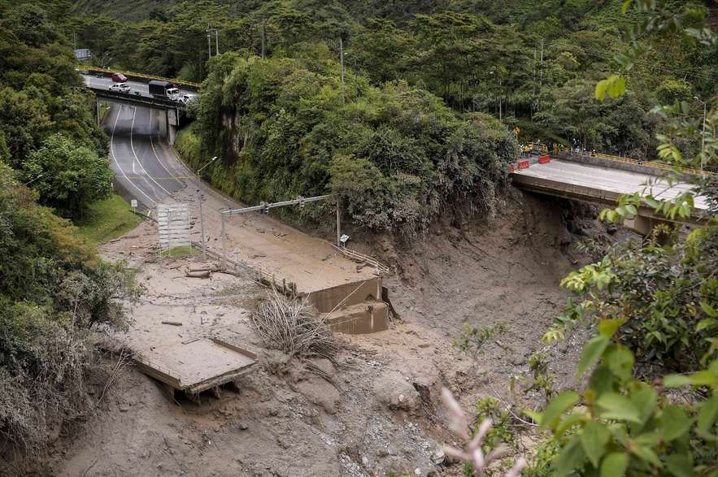

Créditos: Mauricio Alvarado Lozada [El Espectador](https://www.elespectador.com/bogota/las-dolorosas-imagenes-que-deja-la-avalancha-en-quetame-cundinamarca-noticias-hoy/) 


# Estimación cuántitativa de precipitacion utilizando el radar Meterológico de El Tablazo durante la avenida torrencial de la quebrada el Naranjal en el municipio de Quetame, Cundinamarca.

[](https://github.com/ProjectPythia/cookbook-template/actions/workflows/nightly-build.yaml)
[](https://binder.projectpythia.org/v2/gh/ProjectPythia/cookbook-template/main?labpath=notebooks)
[](https://zenodo.org/badge/latestdoi/686482876)


## Motivación

Este cuadernillo tiene como objetivo promover el paradigma emergente de investigación conocido como 'ciencia abierta'. Este enfoque busca fomentar el acceso y la inclusión a los datos hidrometeorológicos de diversas fuentes, así como la reproducibilidad de los códigos, con el fin de impulsar el desarrollo colaborativo y la participación en actividades científicas en todos los niveles de la sociedad.

La ciencia abierta aboga por la transparencia y la colaboración en la investigación científica, fomentando la disponibilidad de datos científicos, la capacidad de reproducir los resultados, y la inclusión de diversos sectores de la sociedad en el proceso de investigación. Además, promueve la comunicación efectiva de los resultados científicos y la divulgación del conocimiento en beneficio de la comunidad en general.

En el marco de este cuadernillo , se realizará la estimación cuántitativa de precipitacion utilizando información proveniente del radar Meterológico de El Tablazo durante la avenida torrencial de la quebrada el Naranjal en el municipio de Quetame, Cundinamarca el 17 de Julio de 2023.
## Autores

[Alfonso Ladino-Rincon](https://github.com/aladinor)

### Colaboradores

<a href="https://github.com/aladinor/Atmoscol2023/graphs/contributors">
  
</a>

## Estructura
El taller estará compuesto por dos sesiones. En la sesión de la mañana trabajeremos con Python y acceso a los datos hidrometeorológicos de diversas fuentes. En la sesión de la tarde trabajaremos anális de series de tiempo usando R.

### Sección 1. Avenida torrencial quebrada El Naranjal
Breve introducción de la avenida torrencial quebrada El Naranjal y sus impactos en el el municipio de Quetame, Cundinamarca.

### Sección 2. Estimación cuantitativa de precipitación

Análisis de los datos del radar de El Tablazo y estimación cuantitativa de la precipitación utilizando modelos Z-R

### Seccion 3. Comparación con información de estaciones en superficie
Utilizando la red de estaciones y sensores de precipitaciones en superfice se realizará una comparación entre los estimados de precipitación derivados del radar meteorológicos y las mediciones en superficie
## Ejecutar los Notebooks

Pueden ejecutar los `notebooks` bien sea usando [Binder](https://mybinder.org/) o localmente en sus maquinas.

### Binder

La forma más sencilla de interactuar con un `Jupyter Notebook` es a través de [Binder](https://binder.projectpythia.org/), que permite la ejecución de un [Jupyter Book](https://jupyterbook.org) en la nube. Los detalles de cómo funciona `binder` no son muy relevantes por ahora. Todo lo que necesitamos saber es cómo iniciar un capítulo de Pythia Cookbooks a través de Binder. Simplemente navegue con el mouse hasta la esquina superior derecha del capítulo del libro que está viendo y haga clic en el ícono del cohete y asegúrese de seleccionar "iniciar Binder". Después de un momento, se te presentará un `Jupyter Lab` con el que podrás interactuar. Es decir. Podrás ejecutar e incluso cambiar los programas de ejemplo. Verás que las celdas de código no tienen salida al principio, hasta que las ejecutes presionando <kbd>Shift</kbd>+<kbd>Enter</kbd>. Los detalles completos sobre cómo interactuar con un cuaderno Jupyter activo se describen en [Introducción a Jupyter](https://foundations.projectpythia.org/foundations/getting-started-jupyter.html).

### Ejecutar de manera local
Si está interesado en ejecutar este material localmente en su computadora, deberá seguir este flujo de trabajo:

1. Clone el repositorio  `https://github.com/aladinor/Puente_quetame.git` usando el siguiente comando de consola:

   ```bash
    git clone https://github.com/aladinor/Puente_quetame.git
   ```

1. Entre en la carpeta de `Atmoscol2023`
   ```bash
   cd quetame
   ```
1. Cree y active su ambiente de desarrollo usando el archivo `environment.yml`
   ```bash
   conda env create -f environment.yml
   conda activate quetame
   ```
1. Vaya a la carpeta `notebooks` y comience una sesión de `Jupyterlab`
   ```bash
   cd notebooks/
   jupyter lab
   ```
